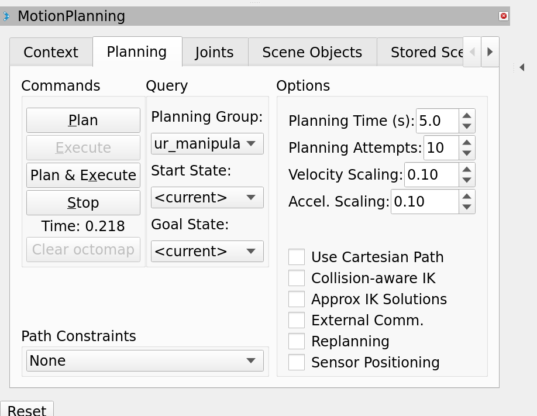
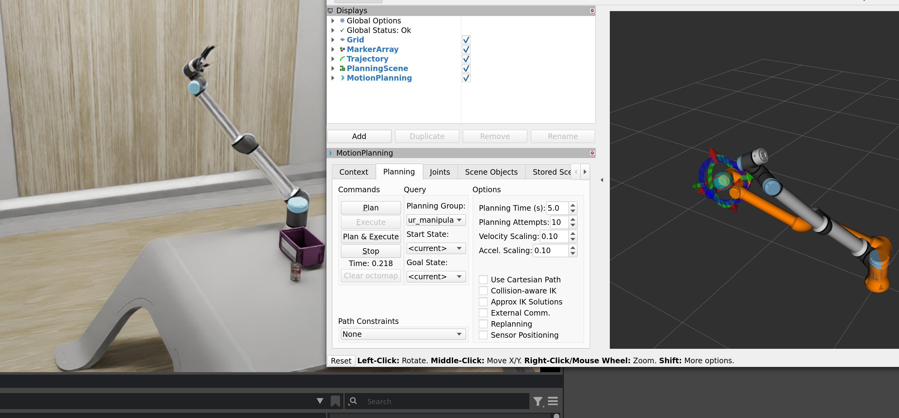

# Controlling Isaac Sim Ur10e via MoveIT CuMotion

Mostly from [this tutorial](https://nvidia-isaac-ros.github.io/concepts/manipulation/cumotion_moveit/tutorial_isaac_sim.html)

## 1. Start Isaac Sim, and Open Stage

> [!IMPORTANT]
> use the asset from **4.5** instead of **4.2**

https://omniverse-content-production.s3-us-west-2.amazonaws.com/Assets/Isaac/4.5/Isaac/Samples/ROS2/Scenario/isaac_manipulator_ur10e_robotiq_2f_140.usd

You can see:


Play the stage

## 2. Start the Isaac ROS Docker image
```bash
cd ${ISAAC_ROS_WS}/src/isaac_ros_common && \
   ./scripts/run_dev.sh
```

Install prebuild package within the docker command line
```bash
sudo apt-get update
sudo apt-get install -y ros-humble-isaac-ros-cumotion-examples
```

## 3. Launch MoveIt and RViz
```bash
ros2 launch isaac_ros_cumotion_examples ur_isaac_sim.launch.py ur_type:=ur10e
```

## 4. In another command line (docker), Generate a URDF for the UR10e
```bash
mkdir -p ${ISAAC_ROS_WS}/isaac_ros_assets/urdf && \
   xacro -o ${ISAAC_ROS_WS}/isaac_ros_assets/urdf/ur10e.urdf \
   /opt/ros/humble/share/ur_description/urdf/ur.urdf.xacro \
   ur_type:=ur10e name:=ur10e
```

Use `nano isaac_ros_assets/urdf/ur10e.urdf` to delete the <ros2_control ...> section, tip: use `Ctrl + K` delete the whole line.


Start the CuMotion planner

```
ros2 run isaac_ros_cumotion cumotion_planner_node --ros-args
   -p robot:=$(ros2 pkg prefix --share isaac_ros_cumotion_robot_description)/xrdf/ur10e.xrdf \
   -p urdf_path:=${ISAAC_ROS_WS}/isaac_ros_assets/urdf/ur10e.urdf
```

And you can see the command line print:
```
[INFO] [1747255396.733883226] [cumotion_action_server]: cuMotion is ready for planning queries!
```

In the MoveIt, choose the `cumotion` in the motion planning context,
Then you can move the End-Effector in the right window, and plan the motion using the `Planning` panel




Finally, when you plan and execute, you can see synchronized movement in both MoveIt and Isaac Sim




