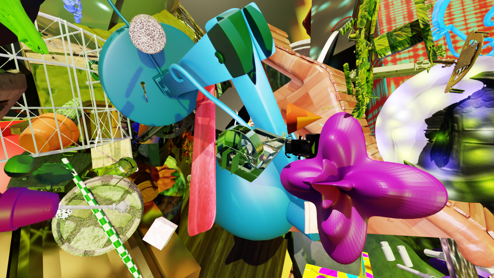
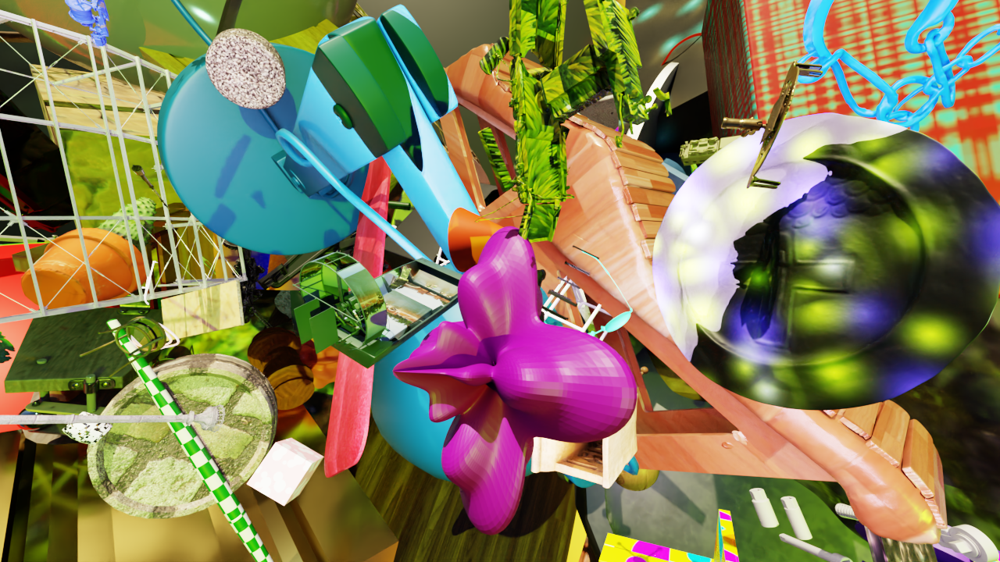
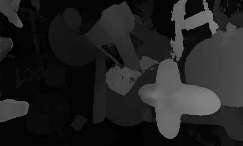

# Standalone Depth Prediction using ESS Tensorrt

This repo shows how to predict depth using a stereo camera. The model card and introduction can be found here: https://catalog.ngc.nvidia.com/orgs/nvidia/teams/isaac/models/dnn_stereo_disparity

## Installation
We use [astral uv](https://docs.astral.sh/uv/#highlights) to install packages.
```bash
uv venv
source .venv/bin/activate
```

1. Install tensorrt (version 10.3.0)
```bash
uv pip install --upgrade pip
uv pip install wheel
uv pip install tensorrt==10.3.0
```

2. Install other dependencies
```bash
uv pip install pycuda
uv pip install matplotlib
```

3. Source your `libcudnn.so.9`, since ESS uses a customized network model, we need to add `libcudnn.so.9` to your path. For example,
```bash
export LD_LIBRARY_PATH=/home/yizhou/Projects/IsaacRosBestPractice/7-depth/.venv/lib/python3.10/site-packages/nvidia/cudnn/lib/:$LD_LIBRARY_PATH
```


> Note: If libcudnn.so.9 is not found in your system by
```bash
find / -name "libcudnn.so*" 2>/dev/null
```

> Note: You might install some deep-learning packages that rely on this package:
e.g.
```bash
uv add sloth
```

## 2. Run Depth prediction via Tensorrt

Convert the `.onnx` model downloaded from: https://catalog.ngc.nvidia.com/orgs/nvidia/teams/isaac/models/dnn_stereo_disparity into tensorrt `.engine`

We refer to this bash script with Isaac Ros environment to perform the conversion: https://github.com/NVIDIA-ISAAC-ROS/isaac_ros_dnn_stereo_depth/blob/main/isaac_ros_ess_models_install/asset_scripts/install_ess_models.sh

The converted model, together with the original plugin, is saved under `./models`

Refer to the images saved in `./image/left.png` and `./image/right.png`

<div display="block"></div>

Run the main function:
```bash
python src/main.py
```

You can choose to set `threshold` to filter out inconfident prediction. And the final `disparity` (w.r.t. the left camera) is saved under `./images/disparity.png`



## Common Questions: 
1. How to rectify the image?
You may notice that this repo ignore the fact that images may be distorted. You can rectify the images via `ROS2` or `Isaac Ros` by reading the `camera_info`. 

2. How to build `isaac_ros_ess` package without gtest?
```bash
colcon build --packages-up-to isaac_ros_ess --cmake-args -DBUILD_TESTING=OFF
```


