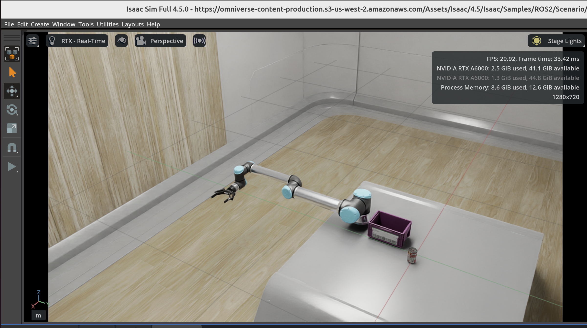
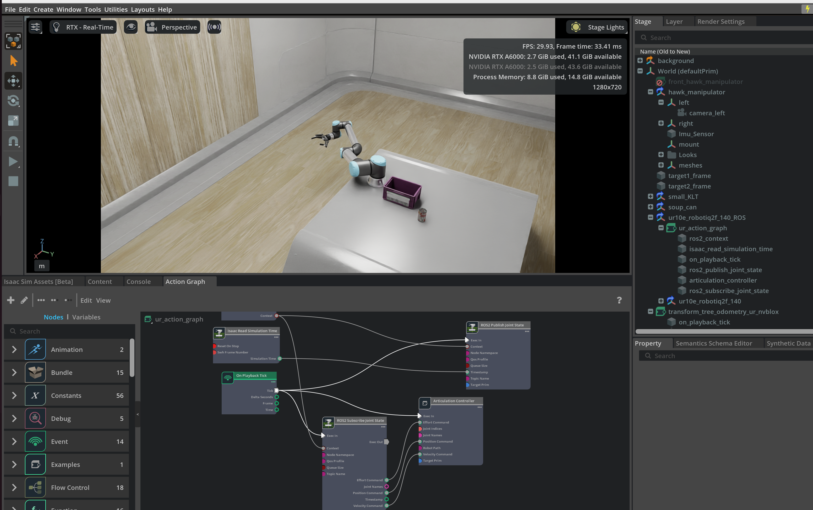

## Controlling Ur10e in Isaac Sim

## 1. Start Isaac Sim, and Open Stage

> [!IMPORTANT]
> use the asset from **4.5** instead of **4.2**

https://omniverse-content-production.s3-us-west-2.amazonaws.com/Assets/Isaac/4.5/Isaac/Samples/ROS2/Scenario/isaac_manipulator_ur10e_robotiq_2f_140.usd

You can see:




## 2. Start the Isaac ROS Docker image
```bash
cd ${ISAAC_ROS_WS}/src/isaac_ros_common && \
   ./scripts/run_dev.sh
```

[Optional] Set up a debugging python environment **Within the docker image**, set up a debugging environment with jupyter
```bash
python -m pip install jupyter

export PATH="$HOME/.local/bin:$PATH"

jupyter-lab
```

Then you can have a notebook running for debugging


## 3. Publishing random joint state:

Refer to the [notebook](./random_movement.ipynb) under this folder to publish joint state topic: `isaac_joint_commands` for joints
```python
[
    'shoulder_pan_joint',
    'shoulder_lift_joint',
    'elbow_joint',
    'wrist_1_joint',
    'wrist_2_joint',
    'wrist_3_joint'
]
```

Start another **seperate Isaac ROS Docker image terminal**, verify that you can see the `isaac_joint_commands` topic:
```bash
ros2 topic list
```
And random joint state:
```bash
ros2 topic echo isaac_joint_commands
```

## 4. Play the Isaac Sim Stage to see the robot random movement




